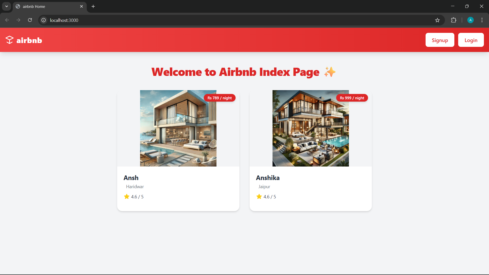
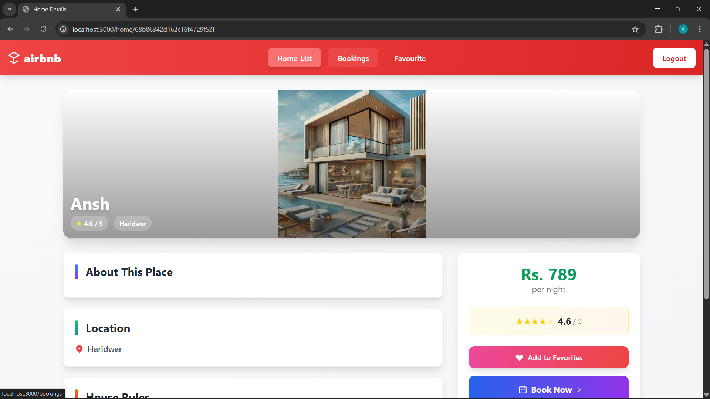
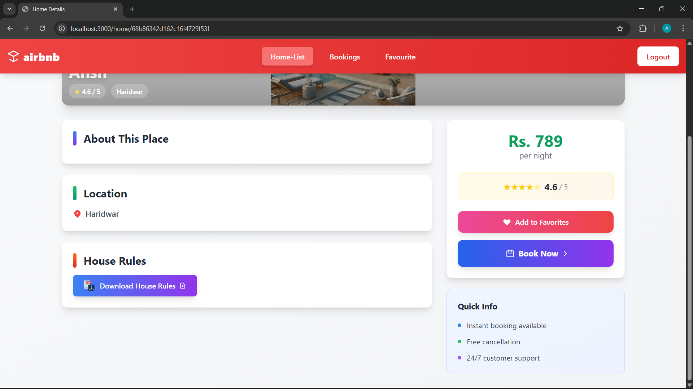
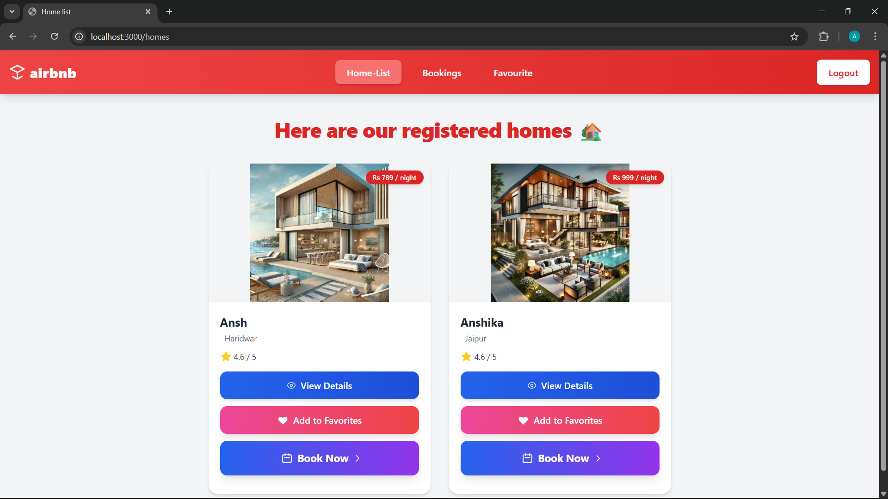
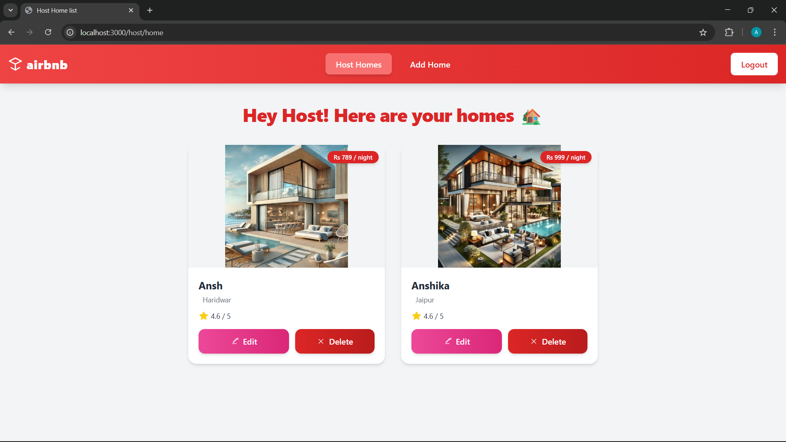
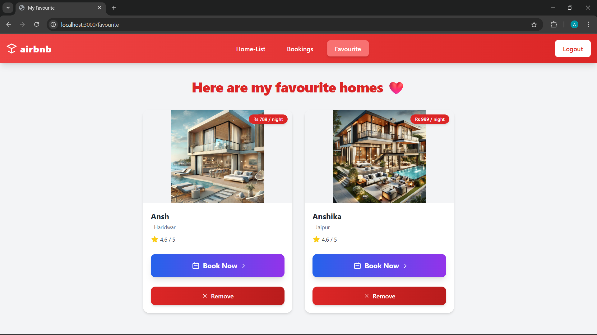
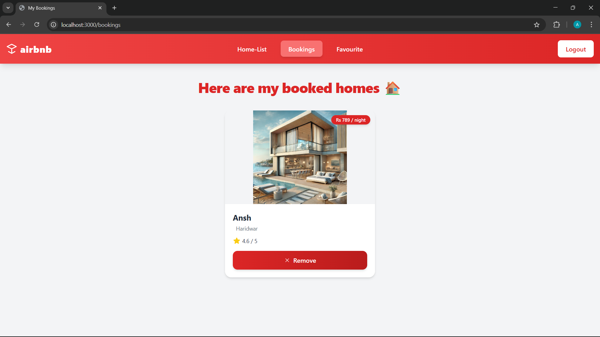

# 🏡 Airbnb-like Clone

A full-stack web application inspired by Airbnb, built with Node.js, Express, MongoDB, and EJS. This platform allows users to experience the core functionalities of a rental booking service, including user authentication, property listings, favorites, and bookings.


## 🎥 Demo

https://github.com/user-attachments/assets/1cd50e98-4af0-4a59-8c3f-0f474a7613ac


## 📸 Screenshots

| Home Page | Property Details | Home List Page |
|-----------|------------------|----------------|
|  | <br> |  |

| Host Dashboard | User Favorites | Booking Page |
|----------------|----------------|--------------|
|  |  |  |


## 🚀 Features

### 👤 User Authentication & Authorization
- User registration and login with secure password hashing using `bcryptjs`
- Session-based authentication using `express-session`
- Two user roles: **Guest** and **Host**
- Protected routes for authenticated users

### 🏠 Property Listings (CRUD Operations)
- **Hosts** can create, read, update, and delete (CRUD) their property listings
- Image upload for properties using `multer`
- Each listing includes name, price, location, rating, description, and photos

### ❤️ Favorites System
- **Guests** can save their favorite properties to a personal list
- Easy add/remove functionality

### 📅 Bookings System
- **Guests** can "book" properties, which adds them to a personal bookings list
- Simple interface to view and manage all bookings

### 🎨 UI/UX
- Responsive design built with **Tailwind CSS**
- Clean and intuitive user interface
- Dynamic content rendering with **EJS templates**

## 🛠️ Tech Stack

- **Backend Framework:** Node.js, Express.js
- **Database:** MongoDB with Mongoose ODM
- **Authentication:** Express-session, bcryptjs
- **Validation:** Express-validator
- **File Handling:** Multer
- **Frontend:** EJS (Embedded JavaScript templating)
- **Styling:** Tailwind CSS

## 📦 Installation & Setup

Follow these steps to set up the project locally on your machine.

### Prerequisites
- Node.js (v14 or higher)
- MongoDB (Local instance or MongoDB Atlas)
- npm or yarn

### Steps

1. **Clone the repository**
   ```bash
   git clone https://github.com/your-username/airbnb-clone.git
   cd airbnb-clone

2. **Install dependencies**
   ```bash
   npm install

3. **Set environment variables**
-   Create a .env file in the root directory and add the following variables:
    ```bash
    MONGODB_URI=your_mongodb_connection_string
    SESSION_SECRET=your_random_secret_key_here
    PORT=3000

- *MONGODB_URI*: from MongoDB Atlas or use local mongodb://localhost:27017/airbnb-clone

- *SESSION_SECRET*: generate a strong random string


4. **Start the development server**
   ```bash
    node app.js
    # or with nodemon
    npm start
5. **Open your browser**
-  Visit 👉 http://localhost:3000

---

## 🧪 Usage

1. **Registration**: Create an account as either a Guest or Host

2. **Host Features:**

-    Add new properties with images

-    Edit or delete your listings

-    View all your properties in the host dashboard

3. **Guest Features:**

-    Browse available properties

-    Add properties to favorites

-    "Book" properties

-    View your bookings and favorites

---